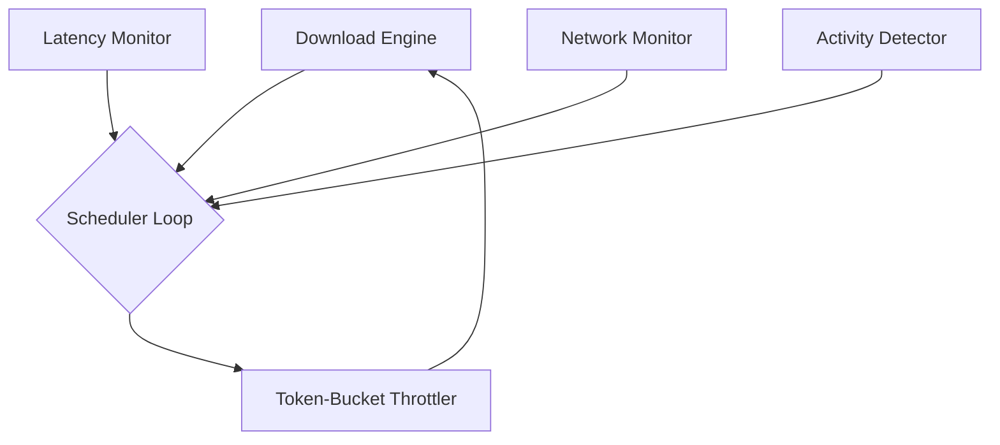

# 🚀 Latency-Aware Intelligent Download Manager

A highly intelligent, multithreaded download engine designed to seamlessly download massive files in the background without causing network lag or bufferbloat while you are gaming or streaming.

The system utilizes an autonomous expert AI loop (AIMD control logic) to constantly scan your local system ports and monitor your router's ICMP ping in real-time. It organically reacts dynamically to what you are doing.

## 🎯 Features

*   **⚡ Latency-Aware Throttling**: Monitors real-time Router Jitter and ICMP round-trip latency. If someone starts streaming Netflix or you boot up a game, the engine detects ping spikes and chokes its own download buffer to preserve network health.
*   **🎮 Activity Detection**: Automatically scans UDP network sockets to heuristically detect if you are playing a multiplayer game (e.g. Valorant, CS2).
*   **🧠 AIMD Control Scheduler**: Functions like TCP BBR—automatically throttling back active Python multithreading count and scaling byte stream buffers depending on the network classification state (`Gaming`, `Streaming`, `Congested`, or `Idle`).
*   **💾 Random Access File Writing**: Does not rely on messy `.part` files. Pre-allocates a sparse shell on your disk using `.seek()` to funnel asynchronous parallel chunks into the perfect byte-offsets.
*   **🛡️ Corruption Prevention**: Atomic `.metadata.json` checkpoint saving to completely protect against abrupt power-failures or `Ctrl+C` interrupt crashes, letting you resume downloads exactly where you left off.
*   **📊 Rich Telemetry Dashboard**: A high-performance 60FPS graphical Terminal UI providing real-time data on active threads, download speeds, and logic states.

## ⚙️ Architecture



## 🛠️ Installation & Setup

1. Make sure Python 3 is installed.
2. Clone this repository and open the directory.
3. Activate your virtual environment and install the dependencies:
```bash
python -m venv .venv
.\.venv\Scripts\Activate.ps1
pip install -r requirements.txt
```

## 💻 Usage

To download a massive file, run the `main.py` script providing the target URL and what you want to name the file locally:

```bash
python main.py "http://example.com/massive_file.rar" my_download.rar
```
*(Tip: Always wrap URLs with special characters like `?` or `&` in strict quotes!)*

### Test the "Gaming" Heuristics

To test the system's dynamic throttling logic, start a download in one terminal using the command above. 

Next, open a completely separate terminal, activate the `.venv`, and execute:
```bash
python mock_gaming.py
```
This utility will rapidly fire empty local UDP packets mimicking a real multiplayer game. If you watch your primary terminal dashboard, you will instantly watch the state shift from `Idle` ➡️ `Gaming` and observe your thread limits instantly choke down to save your latency!
